# Conan

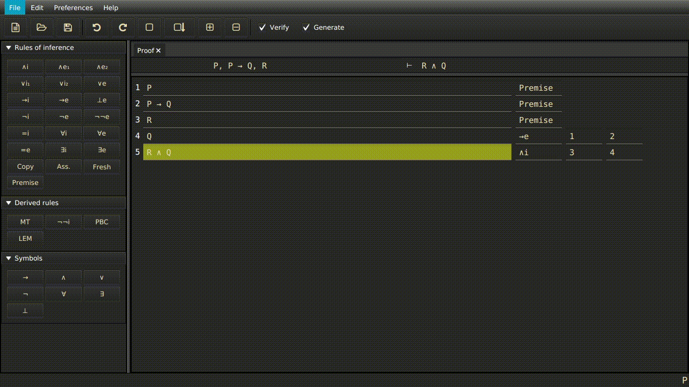

**A proof editor for first order logic made for students learning first order logic.**

## Short overview

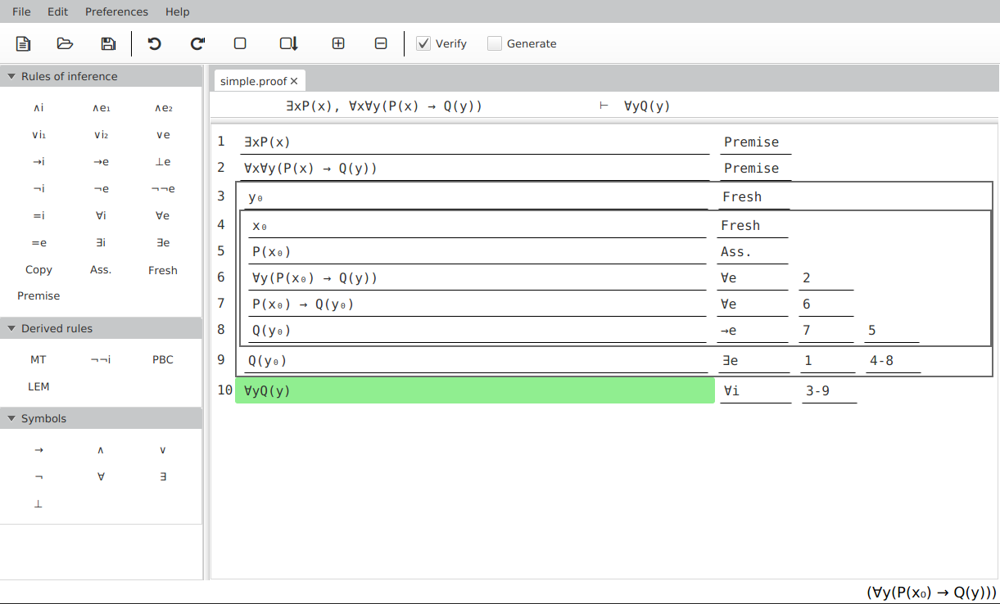

Conan offers a design that is akin to text editors, which allows the user to familiarise themselves with the program faster from their common use of the former. The user is allowed to jump to any row of the proof and is able to insert new rows or delete and edit old rows to correct mistakes or even introduce new ones.

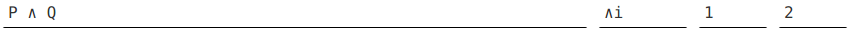

A row consists of a formula field, a rule field and up to three reference fields. The formula field is where the user inputs the desired formula and the rule field should contain the rule that justifies it. References fields are only shown when the rule requires them and are used in conjunction with that specific rule.

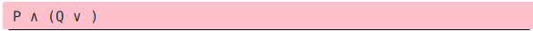

The user is free to input any type of formula, including formulas that are not well-formed. However, while the formula is not well-formed, the formula field turns pink, instantly alerting the user of the mistake they introduced.

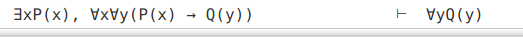

At the top of the proof we have the sequent, which will be updated automatically, adding all the premises of the proof. The consequent of the sequent is used to indicate when the goal has been reached in a valid way. This is indicated with a green colour.

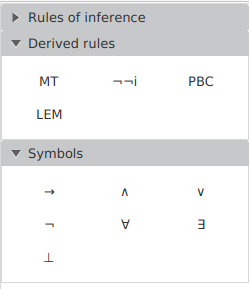

There are collapsible panes of buttons showcasing the rules of natural deduction, a few derived rules and the symbols which are used in the program. The user may press these buttons to input the rule or symbol to the active field or row. Collapsing the pane allows the user to hide the buttons and work on their recall at will.

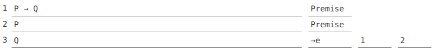

In the short proof, we have that the first two rows are verified since both of them are well-formed formulas that are justified by being premises. The third row is verified since implication elimination takes one implication as a reference and the left hand side of the implication as the other reference. A final check makes sure that the right hand side of the implication matches the row in question.

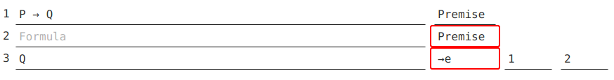

Erasing the formula in row two makes the row unverified and affects the third row. Red frames appear, surrounding the rules, alerting the user of the error.

For this proof, we may also generate the formula of the third row by first inputting two verified rows and then inputting both the rule and the correct references in the third row, generating the formula automatically resulting in the same proof as before.

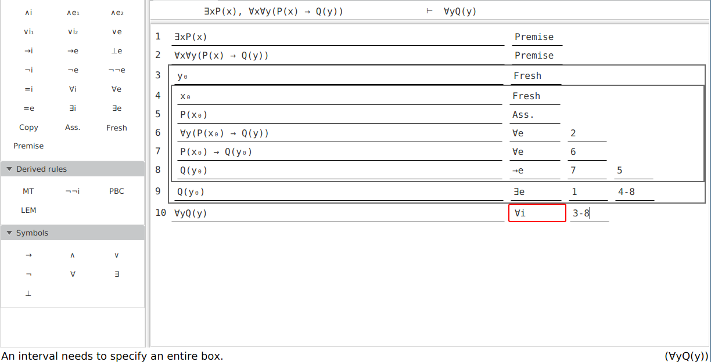

The status bars are located at the bottom of the program. The left status field is used to indicate errors and the right status field shows how the formula is interpreted in the program. The errors in the status bar are minimal and only indicate basic slips, instead of indicating errors in proof strategy or faulty reasoning.

## Videos

Wellformedness

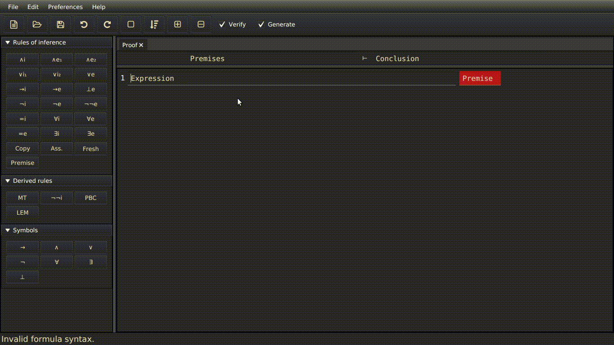

Export to LaTeX

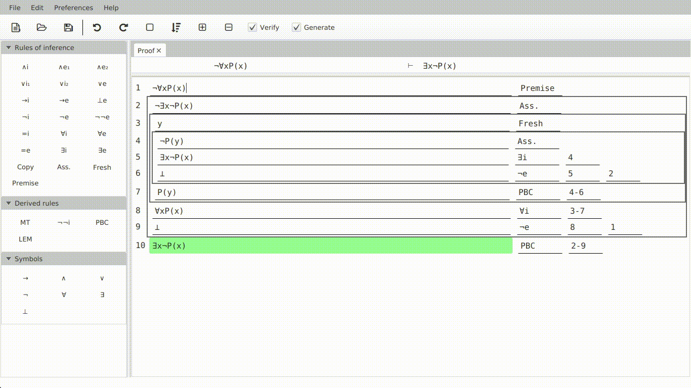
